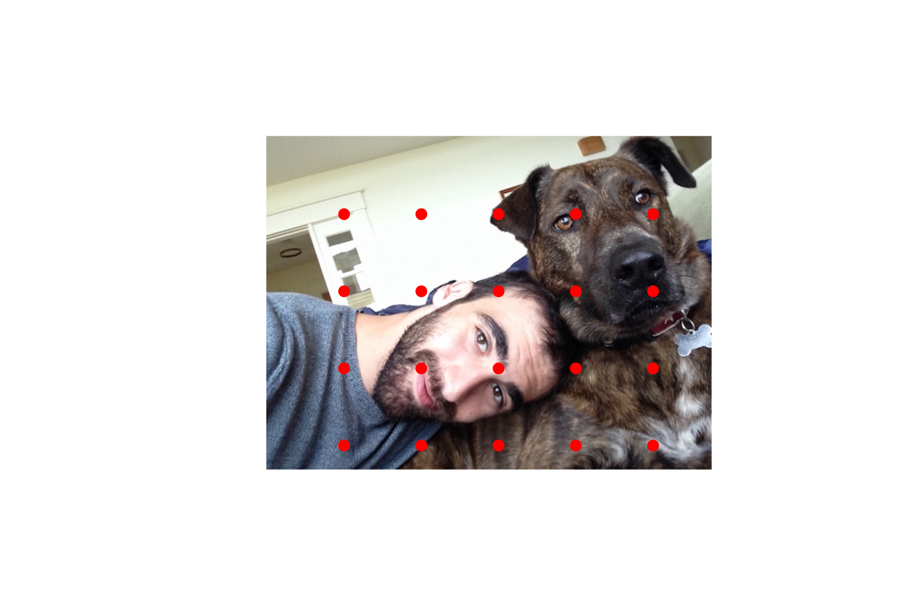
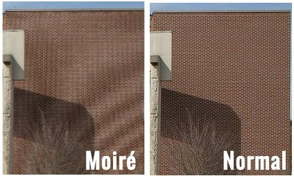

# Random_Sampling

Based off of Mike Bostocks ["Visualizing Algorithims"] (https://bost.ocks.org/mike/algorithms/). Random Sampling is used in image processing and feature recognition. The idea is that to convert light (or any continuous signal) into something useable/storable in a computer you need to convert it to discrete impulses. Choosing areas of the image to best characterize the image is called sampling.

[sampling graph](Images/sampling.png)

The idea is to take samples that will allow the signal to be recreated later by just the samples alone.

When choosing these points, you don't want to just choose evenly spaced points accross the image: 

*Don't do this:*

This is because choosing even spaced samples can lead to Moiree patterns, which are distinct ripples or other patterns that appear in the image when some of the light signals generated are too similar to one another. For example, if not corrected, the picture below of the brick wall will result in moiree patterns due to the repeating bricks.

Instead you want to choose points that are *MOSTLY* evenly distributed but still have some variation to them so there are no repeated patterns that would cause problems. There are a number of ways to do this and I will be focusing on some methods that fall under the category of Random Sampling.
